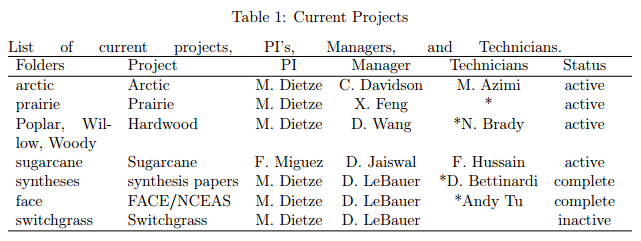
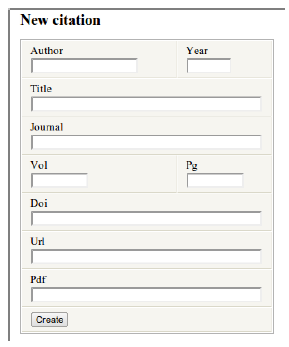
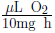

# Data Entry
## Getting Started

You will need to create the following accounts:
* Redmine https://ebi-forecast.igb.illinois.edu/redmine/account/register
* BETYdb https://www.betydb.org/signup
* GitHub https://github.com/
* Mendeley www.mendeley.com/

Then please read the [Data Entry Workflow](https://www.betydb.org/dbdocumentation_data_entry.pdf).

## 1. Overview
This the userguide for entering data into the BETYdb database. The goal of this guide is to provide a consistent method of data entry that is transparent, reproducible, and well documented. The steps here generally accomplish one of two goals. The first goal is to provide data in a consistent framework that is associated with the experimental methods, species, site, and other factors associated with the original study. The second goal is to provide a record of all the transformations, assumptions, and data extraction steps used to migrate data from the primary literature to the standardized framework of the database. This second goal not only supports the scientific value of the data itself, it also simplifies the Quality Assurance process. 

## 2. Using Mendeley
Mendeley provides a central location of the collection, annotation, and tracking of the journal articles that we use. Features of Mendeley that are useful to us include: 
* Collaborative annotation & notes sharing: see [Section 2.2](#Section_2.2)
    * Text highlighter   
    * Sticky notes for comments in the text
    * Notes field for text notes in the reference documentation
* Read/ unread & favorites:
Papers can be marked as **read** or **unread**, and may be **stared.**
* Groups: see [Section 2.1](#Section_2.1)
* Tagging

###  2.1 Creating a new group on Mendeley (Project Managers)
Each project has two groups, "projectname" and "projectname_out" for the papers with data to be entered and the papers with data that has been entered. Papers in the _out group may contain data for future entry, for example, traits that are not listed in [Table 6] (#Table 6).  

Each project manager may have one or more projects, each project should have one group. Group names should refer to plant species, plant functional types, or another project specific name. A list of current groups can be found in [Table 1](#Table 1). Please make sure that, at a minimum, Mike Dietze and David LeBauer are invited to join each project folder. 
   1. Open Mendeley desktop
   2. Click `Edit` → `New Group` or `Ctrl+Shift+M`
   3. Create group name following instructions above
   4. Enter group name 
   5. Set `Privacy Settings` → `Private`
   6. Click `Create Group`
   7. Click `Edit Settings`
   8. Under `File Synchronization`, check `Download attached files to group`

###  2.2 Adding and annotating papers (Project Managers)

The ’tag’ field associated with each paper can be used to further
separate papers, for example by species, or the type of data (’trait’,
’yield’, ’photosynthesis’) that they contain. When naming a group, tag
folders so that instructions for a technician would include the folder
and the tag to look for, e.g. "please enter data from projectx" or
"please enter data from papers tagged y from project x".

To access the full text and PDF of papers from off campus, use the [UIUC
VPN](http://www.cites.illinois.edu/vpn/download-install.html) service.

If you are managing a Mendeley folder that undergraduates are actively
entering data from, please plan to spend between 15 min and 1 hour per
week maintaining it - enough to keep up with the work that the
undergraduates are doing.

#### 2.2.1 Adding a reference to Mendeley

-   If the DOI number is available (most articles since 2000)
    1.  Select project folder
    2.  Right click and select `Add entry manually...`
    3.  Paste DOI number in *DOI* field
    4.  Select the search spyglass icon
    5.  Drag and drop PDF onto the record.
-   If DOI not available:
    1.  Download the paper and save as `citation_key.pdf`
    2.  Add using the *Files* field
    3.  The citation key should be in `authorYYYYabc` where `YYYY` is
        the four digit year and `abc` is the acronym for the first three
        words excluding articles (the, a, an), prepositions (on, in,
        from, for, to, etc...), and the conjunctions (for, and, nor,
        but, or, yet, so) with less than three letters.

#### 2.2.2 Annotating a Reference in Mendeley

Each week, please identify and prepare papers that you would like to be
entered next by completing the following steps:  
1.  Use the star label to identify the papers that you want the student
    to focus on next.
    -   Start by keeping a minimum of 2 and a maximum of 5 highlighted
        at once so that students can focus on the ones that you want.
        Students have been entering 1-3 papers per week, once we get
        closer to 3-5, the min/max should change.
    -   Choose papers the papers that are the most data rich.  
2.  For each paper, use comment bubbles, notes field, and highlighter to
    indicate:
* Name(s) of traits to be collected
* Methods:
    * Site name
    * Location
    * Number of replicates
    * Statistics to collect
    * Identify treatment(s) and control
    * Indicate if study was conducted in greenhouse, pot, or growth chamber  
* Data to collect
    * Identify figures number and the symbols to extract data from.
    * Table number and columns with data to collect
* Covariates
* Management data (for yields)
* Units in 'to' and 'from' fields of used to convert data
* Esoteric information that other scientists or technicians might not catch and that are not otherwise recorded in the database
* Any data that may be useful at a later date but that can be skipped for now.

**Comment or Highlight**
* Sample size
* Covariates (see [Table 7](#Table 7))
* Treatments
* Managements
* Other information entered into the database, e.g. experimental
    details

### 2.3 Finding a citation in Mendeley

To find a citation in Mendeley, go to the project folder. Group folders
and personnel are listed in [Table 1](#Table 1). By default, data entry technicians should
enter data from papers which have been indicated by a yellow star and in
the order that they were added to the list. Information and data to be
collected from paper can be found under the 'Notes' tab and in
highlighted sections of the paper.

## 3. Google Spreadsheets: Recording data transformations
Google Spreadsheets are used to keep a record of any data that is not
entered directly from the original publication.

* Any raw data that is not directly entered into the database but that
    is used to derive data or stats using equations in [Table 1](#Table 1)and [Table 5](#Table 5).
* Any data extracted from figures, along with the figure number
* Any calculations that were made. These calculations should be
    included in the cells.

Each project has a google document spreadsheet with the title
’’project\_data’’. In this spreadsheet, each reference should have a
separate worksheet labeled with the citation key (`authorYYYabc`
format). Do not enter data into excel first, this is prone to errors and
information such as equations may be lost when uploading or
copy-pasting.

## 4. Redmine: Reporting errors, suggesting features
### 4.1 Reporting errors in Redmine 
### 4.2 Suggesting features in Redmine

## 5. BETYdb: Entering new data through the web interface
Before entering data, it is first necessary to (add and) select the
citation that is the source of the data. It is also necessary for each
data point to be associated with a Site, Treatment, and Species.
Cultivar information is also required when available, but is only
relevant for domesticated species. Fields with an asterisk (*) are
required.  

 
  

### 5.1 Adding a Citation
Citation provides information regarding the source of the data. This
section should allow us to locate and access the paper of interest.

A PDF copy of each paper should be available through Mendeley.

1.  Select one of the starred papers from your projects Mendeley folder.
2.  The data to be entered should be specified in the notes associated
    with the paper in Mendeley
3.  Identify (highlight or underline) the data (means and statistics)
    that you will enter
4.  Enter citation information [Figure 1](#Figure 1)
    * [Data entry form](http://ebi-forecast.igb.uiuc.edu/bety/sites/new) for a new
        site: `BETYdb` → `Citations` → `new`
    *  Author: Input the first author’s last name only
    *  Year: Input the year the paper was published, not submitted, reviewed,
        or anything else
    *  Fill out Title, Journal, Vol, & Pg. For unknown information, input NA
    *  DOI: the 'digital object identifier'. If DOI is available, PDF and
        URL are optional. This can be located in the article or in the
        article website. Use Ctrl+F 'DOI' to find it. Some older
        articles do not have a DOI.
    *  URL: web address of the article, preferably from publishers website
    *  PDF: URL of the PDF of the article

    

**Figure 1**: Form for entering a new citation 

### 5.2 Adding a Site

Each experiment is conducted at a unique site. In the context of BETY,
the term 'site' refers to a specific location and it is common for many
sites to be located within the same experimental station. By creating
distinct records for multiple sites, it is possible to differentiate
among independent studies.

1.  Before adding a site, search to make sure that site is not already
    entered in database.
2.  Search for the site given latitude and longitude
    -   If an institution name or city and state are given, try to
        locate the site on Google Maps
    -   If a site name is given, try to locate the site using a
        combination of Google and Google Maps
    -   If latitude and longitude are given in the paper, search by lat
        and lon, this will return all sites within $\pm1$ degree lat and
        long.
    -   If an existing site is plausibly the same site as the one
        mentioned in the paper, it will be necessary to check other
        papers linked to the existing site.
        -   Use the same site if the previous study uses the *exact same
            location* and experimental setup.
        -   Create a new site if the study was conducted in a different
            fields (i.e., not the exact same location).
        -   Create a new site if one study was conducted in a greenhouse
            and another in a field.
        -   Do not use distinct sites for seed source in a common garden
            experiment (see ’When not to enter a new site’ below)
3.  To use an existing site, click 'edit' for the site, and then select
    current citation under 'add citation relationships'
4.  If site does not exist, add a new site.  

    **When not to enter a new site**: When plants (or seeds) are collected from multiple locations and then grown in the same location, this is called 'common garden experiment'. In this case, the location of the study is included as site information. Information about the seed source can be entered as a distinct cultivar.  

    **Site Name***:     Site identifier, sufficient to uniquely identify the site within the
paper  

    **City**:   Nearest city      
    
    **State**:   State, if site is in US      
    
    **Country***        
    
    **Longitude***      
    
    **Latitude***: Latitude and Longitude must be in decimal form. To convert
    minute-second to decimal degrees, see the equation in [Table 9](#Table 9).     
    
    **Greenhouse***:   set Greenhouse = TRUE if plants were grown in a greenhouse, growth
    chamber, or pots. If a 'warming chamber' or 'greenhouse' is used as
    the experimental manipulation, but is not used in the control
    treatments, Greenhouse = FALSE.    
    
    **Soil**:   Soil class is entered as a categorical variable that describes the
    texture. If percent clay, sand, and silt are given, [Figure 2](#Figure 2) can be used to
    look up the class.    
    
    **SOM**:   Soil organic matter (% by weight)  
    
    **MAT**:   Mean Annual Temperature (°C)    
    
    **MAP**:   Mean Annual Precipitation (mm)    
    
    **MASL**:   Elevation (meters above sea level, m)    
    
    **Notes**:   site details not included above    
    
    **Soilnotes**:   soil details not included above    
    
    **Rooting Zone Depth**:   Depth of rooting zones in meters  
    
    **Depth to Water Table**:   Depth to water table in meters    

  
![Alt text] (figures/soil triangle.png "Figure 2")

**Figure 2**: USDA Soil Classification

#### 5.2.1 Site Location 

If latitude and longitude coordinates not available, it is often
possible to determine the site location based on the site name, city,
and other information. One way to do this would be to look up a location
name in [Google Maps](http://maps.google.com) and then locate it on the
embedded map. Google Maps can provide decimal degrees if the LatLng
feature is enabled, which can be done
[here](http://maps.google.com/maps?showlabs=1). Google Earth can be
particularly useful in locating sites, along with their coordinates and
elevation. Alternatively, the site website or address might be found
through an internet search (e.g. Google).

Use [Table 2](#Table 2) to determine the number of significant digits to indicate the level
of precision with which a study location is known.  

**Table 2**: Appropriate precision for site latitude and longitude
 ![Alt text] (figures/table 2.png "Table 2")  

 ![Alt text] (figures/new site.png "Figure 3")  
**Figure 3**: Form for entering a new site

### 5.3 Adding a Treatment
Treatments provide a description of a study’s
treatments. Any specific information such as rate of fertilizer
application should be recorded in the managements table [Section 5.4] (#Section 5.4) . In
general, managements are recorded when Yield data is collected, but not
when only Trait data are collected.

**When not to use treatment**: predictor variables that are not based on distinct managements, or that are distinguished by information already contained in the trait (e.g. site, cultivar, date fields) should not be given distinct treatments. For example, a study that compares two different species, cultivars or genotypes can be assigned the same control treatment; these categories will be distinguished by the species or cultivar field. Another example is when the observation is made at two sites: the site field will include this information. 

A treatment name is used as a categorical (rather than continuous)
variable: it should be easy to find the treatment in the paper based on
the name in the database. The treatment name does not have to indicate
the level of treatment used in a particular treatment - this information
will be included in management table.

It is essential that a control group be identified with each study. If
there is no experimental manipulation, there is only one treatment. In
this case, the treatment should be named 'observational' and listed as
control.

To determine the control when it is not explicitly stated, first
determine if one of the treatments is most like a background condition
or how a system would be in its non-experimental state. In the case of
crops, this could be how a farmer would be most likely to treat a crop.

   **Name**:   indicates type of treatment; it should be easy for anyone with the
    original paper to be able to identify the treatment from its name.

   **Control**:   make sure to indicate if the treatment is the study 'control' by
    selecting true or false

   **Definition**:   indicates the specifics of the treatment. It is useful for
    identification purposes to use a quantified description of the
    treatment even though this information can only be used for analysis
    when entered as a management.
    
**Figure 4**: Form for entering a new treatment  
 ![Alt text] (figures/new treatment.png "Figure 4")

 ![Alt text] (figures/example treatment form.png "Figure 5")  

**Figure 5**: Example treatment form with control and experimental information. Example of data entered into the treatment form for a control (left) and treatment (right)

### 5.4 Adding a Management 
Managements refers to something that occurs at a specific time and has a
quantity. Managements include actions that are done to a plant or
ecosystem, for example the planting density or rate of fertilization.
Managements are distinct from Treatments in that a Treatment is used to
categorically identify an experimental treatment, whereas a management
is used to describe what has been done.

Managements are the way a treatment becomes quantified. Each treatment
is often associated with multiple managements. The combination of
managements associated with a particular treatment will distinguish it
from other treatments. The management types that can be entered into
BETY are described in [Table 3](#Table 3).

Each management may be associated with one or more treatments. For
example, in a fertilization experiment, planting, irrigation, and
herbicide managements would be applied to all plots but the
fertilization will be specific to a treatment. For a multi-year
experiment, there may be multiple entries for the same type of
management, reflecting, for example, repeated applications of herbicide
or fertilizer, for example see [Figure 6](#Figure 6).

*note:* At present, managements are recorded for Yields but not for
Traits, unless specifically required by the data or project manager.

To associate a management with multiple treatments, first create the
management, then edit the management and add treatment relationships.

**Dateloc**:   date level of confidence, explained in [Section 5.5](#Section_5.5) and defined in [Table 6](#Table 6)

**Mgmttype**:   the name of the management being used. A list of standardized
    management types can be found in [Table 3](#Table 3) 

**Level**:   a quantification of mgmttype  

**Units**:   refers to the units of the level. Units should be converted to those
    in  [Table 3](#Table 3)
  

![Alt text] (figures/treatments associated.png "Figure 6")   

**Figure 6**: Form for entering and editing relationships between treatments and managements

### 5.5 Adding a Trait

In general, a 'trait' is a phenotype; a characteristic that the plant
exhibits. The traits that we are primarily interested in collecting
data for are listed in [Table 6](#Table 6).

Before adding trait data, it is necessary to have the citation,
treatments, and site information already entered. If the correct
citation is not identified at the top of the page [Figure 8](#Figure 8). To add a new Trait,
go to the [new trait](http:ebi-forecast.igb.uiuc.edu/bety/traits/new)
page: `Trait` → `new`.

Presently, we are also using the Trait table record ecosystem level
measurements other than Yield. Such ecosystem level measurements can
include leaf area index or net primary productivity, but are only
collected when required for a particular project.

shows the web form for entering new trait data, and provides a list of
the traits that we are interested in collecting.

Most of the fields in the Traits table are also used in the Yields
table. Here is a list of the fields with a brief description, followed
by more thorough explanations:

**Species***:   Search for species in the database using the search box; if species
    is not found, see  

**Cultivar**:   primarily used for crops; If the cultivar being used is not found in
    drop-down box, see hyperref[sec:addcultivar]Section
    [sec:addcultivar]: Adding a Cultivar.  

**DateLOC**:   Date Level of confidence. See for values.  

**Mean***:   mean is in units of tons per hectare per year (t/ha)  

**Stat name**:   is name of the statistical method used (usually one of SE, SD, MSE,
    CI, LSD, HSD, MSD). See for more details.  

**Statistic**:   is the value of the statistic associated with Stat name.  

**N**:   Always record N if provided. N is the number of experimental
    replicates, often referred to as the sample size; N represents the
    number of independent units within each treatment: in a field
    setting, this is often the number of plots in each treatment, but in
    a greenhouse, growth chamber, or pot-study this may be the number of
    chambers, pots, or individual plants. Sometimes this value is not
    clearly stated.  

**Figure 7**: Form for entering management data with example data. This management denotes a nitrogen fertilization rate of 112.0 kg N ha-1  

![Alt text] (figures/new management.png "Figure 7")   

![Alt text] (figures/top citation.png "Figure 8") 

**Figure 8**: When entering data, the citation is identified at the top of the page  

#### 5.5.1 dateLOC

The date level of confidence (DateLOC) provides an indication of how
accurately the date associated with the trait or yield observation is
known. provides the values that should be entered in this field. If the
event occurred at a level of precision not defined by an integer in this
table, use fractions. For example, we commonly use 5.5 to indicate a one
week level of precision. If the exact year is not known, but the time of
year is, use 91 to 97, with the second digit to indicate the information
known within the year.

![Alt text] (figures/new trait.png "Figure 9")  
**Figure 9**: Form used to enter a new trait.

#### 5.5.2 Statistics

Our goal is to record statistics that can be used to estimate standard
deviation or standard error. Many different methods can be used to
summarize data, and this is reflected in the diversity of statistics
that are reported. An overview of these methods is given in and a
description below.

Where available, direct estimates of variance are preferred, including
Standard Error (SE), sample Standard Deviation (SD), or Mean Squared
Error (MSE). SE is usually presented in the format of
$\text{mean} (\pm \text{SE})$. MSE is usually presented in a table. When
extracting SE or SD from a figure, measure from the mean to the upper or
lower bound. This is different than confidence intervals and range
statistics (described below), for which the entire range is collected.

If MSE, SD, or SE are not provided, it is possible that LSD, MSD, HSD,
or CI will be provided. These are range statistics and the most
frequently found range statistics include a Confidence Interval (95%CI),
Fisher’s Least Significant Difference (LSD), Tukey’s Honestly
Significant Difference (HSD), and Minimum Significant Difference (MSD).
Fundamentally, these methods calculate a range that indicates whether
two means are different or not, and this range uses different approaches
to penalize multiple comparisons. The important point is that these are
ranges and that we record the entire range.

Another type of statistic is a “test statistic”; most frequently there
will be an F-value that can be useful, but this should not be recorded
if MSE is available. Only if there is no other information available,
record the P-value.

### 5.6 Adding a Yield

The protocol for entering yield data is identical to entering data for a
trait, with a few exceptions:

1.  There are no covariates associated with yield data

2.  Yield data is always the dry harvestable biomass; if necessary,
    moisture content can be added as a trait

### 5.7 Adding a Covariate

Covariates are required for many of the traits. Covariates generally
indicate the environmental conditions under which a measurement was
made. Without covariate information, the trait data will have limited
value.

A complete list of required covariates can be found in . For all
respiration rates and photosynthetic parameters, temperature is recorded
as a covariate. Soil moisture, humidity, and other such variables that
were measured at the time of the measurement that may be required in
order to standardize across studies.

When root data is recorded, the root size class needs to be entered as a
covariate. The term ’fine root’ often refers to the \<2mm size class,
and in this case, the covariate `root_maximum_diameter` would be set to
2. If the size class is a range, then the `root_minimum_diameter` can
also be used.

To add a new covariate, go to the [new
covariate](http:ebi-forecast.igb.uiuc.edu/bety/covariates/new) page:
`Covariate` → `new`.

#### 5.7.1 Extracting information from tables and graphs

1.  Identify the data that is associated with each treatment

    *note:* If the experiment has many factors, the paper may not report the mean and statistics for each treatment. Often, the reported data will reflect the results of more than one treatment, for example if there was no effect of the treatment on the quantity of interest. In some cases it will be possible the values for each treatment, e.g. if there are _n-1_ values and _n_ treatments. If this is not the case, the treatment names and definitions should be changed to indicate the data reflect the results of more than one experimental treatments. 

2.  Enter the mean value of the trait

3.  Enter the `statname`, `stat`, and number of replicates, `n`
    associated with the mean
    *  `stat` is the value of the `statname` (i.e. `statname` might be
        ’standard deviation’ (SD) and the `stat` is the numerical value
        of the statistic)
    *  Always measure size of error bar from the mean to the end of an
        error bar. This is the value when presented as __X\pm SE$__ or
        _X(SE)_ and may be found in a table or on a graph.
    *  Sometimes CI and LSD are presented as the entire range from the
        lower to the upper end of the confidence interval. In this case,
        take 1/2 of the interval representing the distance from the mean
        to the upper or lower bound

#### 5.7.2 Extracting Data From a Figure using R

To extract data from a jpg file in R using the digitize package:  

1.  Save image as a `*.jpg` file
2.  Open R
3.  Change the directory that R is using to the one where the image is
4.  Use R code below to extract data, display it, and save it in a `csv`
    file steps below
5.  Upload csv to the project file in google spreadsheet, or open as
    excel/openoffice and copy/paste to google spreadsheet

    `library('digitize')    
    calpts <- ReadAndCal('authorYYYabc_fixX.jpg')   
       ## click on xaxis min (x1), xaxis max (x2),   
       ## yaxis min(y1), yaxis max (y2)  
    pts <- DigitData(col='red',type='p',n=8)  
       ## set n = to the number of points to collect   
    data <- Calibrate(pts, calpts, x1, x2, y1, y2)  
       ## x1, x2, y1, and y2 are the min and max of the x and y axes, respectively.  
    print(data)  
    write.csv(data, 'authorYYYYabc_figX.csv')`
  
#### 5.7.3 Extracting Data From a Figure using GetData

1.  Open PDF in Adobe Reader.
2.  Zoom in on the figure
3.  Choose `Tools` → `Select and Zoom`
4.  Open Paint
5.  Paste Picture
6.  Save as `authorYYYYabc\_figX.jpg`
7.  Open Get Data
8.  `File` → `open` open figure
9.  Select button with two arrows (fourth from left)
10. Follow instructions to select x min, x max, y min and y max. If the
    x-axis has a categorical variable, it does not matter what values
    you use for x min and x max.
11. Make sure to set the correct values for the max and min of each
    axis, and indicate if the axis is log-scaled
12. Select the target button (seven from left)
13. Click over center of desired data points and error bars
14. Copy data to google spreadsheet (see Section
    [sec:googlespreadsheets]
15. Calculate SE as the distance between the error bar upper bound and
    the mean (absolute value of difference between the two points)

### 5.8 Adding a Yield

To add a new Yield, go to the [new
yield](http:ebi-forecast.igb.uiuc.edu/bety/yields/new) page: `Yield`
 → `new`. Yield is equivalent to aboveground biomass on a per-area
basis, and has units of Mg ha~-1~ y1

### 5.9 Adding a PFT

Plant functional types (PFTs) are used to group plants for statistical
modeling and analysis. PFTs are associated with both a specific set of
priors, and a the subset species for which the traits and yields data
will be queried. In many cases, it is appropriate to use default PFTs
(e.g. `tempdecid` is temperate deciduous trees)

In other cases, it is necessary to define PFTs for a specific project.
For example, to query a specific set of priors or subset of species, a
new PFT may be defined. For example, Xiaohui Feng defined PFT’s for the
species found at the EBI Farm prairie. Such project-specific PFTs can
be defined as `` `projectname`.`pft` `` (i.e. `ebifarm.c4grass` instead
of `c4grass`).

### 5.10 Adding a Species

Species that are found or cultivated in the United States should be in
the Plants table. Look it up there first.

### 5.11 Adding a Cultivar

## 6. BETYdb: Bulk Data Upload

Currently the web interface does not support bulk data upload, although
this is a planned feature for BETY 2.0.

For bulk data upload, or for a complete view of the tables in BETY, a
blank spreadsheet can be found
[online](https://spreadsheets0.google.com/spreadsheet/pub?hl=en&hl=en&key=0Ai_PDCcY5g2JdFN1UDJJdjNsZk9RM0Z6bnFDdlQ0clE&output=html)
and can be downloaded in .xls format
[spreadsheet](https://spreadsheets0.google.com/spreadsheet/pub?hl=en&hl=en&key=0Ai_PDCcY5g2JdFN1UDJJdjNsZk9RM0Z6bnFDdlQ0clE&output=xls).
Contact [David LeBauer](mailto:dlebauer@illinois.edu) or [Mike
Dietze](mailto:mdietze@illinois.edu) for more information about using
this method of data upload.

##7. BETYdb: QA/QC with the Web Interface

Quality assurance and quality control (QA/QC) is a critical step that is
used to ensure the validity of data in the database and of the analyses
that use these data. When conducting QA/QC, your data access level needs
to be elevated to “manager”.

1.  Open citation in Mendeley
2.  Locate citation in BETYdb
    -   Select ’use’
    -   Select ’show’
    -   Check that author, year, title, journal, volume, and page
        information is correct
    -   Check that links to URL and PDF are correct, using doi if
        available
    -   If any information is incorrect, click ’edit’ to correct.
3.  Check that site(s) at bottom of citation record match site(s) in
    paper
    -   Check that latitude and longitude are consistent with
        manuscript, are in decimals not degrees, and have appropriate
        level of precision .
    -   Click on site name to verify any additional information site
        information that is present
    -   Enter any additional site level information that is found
4.  Select
    [treatments](http://ebi-forecast.igb.uiuc.edu/bety/treatments/) from
    menu bar
    -   Check that there is a control treatment
    -   Ensure that treatment name and definition are consistent with
        information in the manuscript.
    -   Under “treatments from all citations associated with associated
        sites”, ensure that there is no redundancy (i.e. if another
        citations uses the same treatments, it should not be listed
        separately)
    -   If managements are listed, make sure that managment-treatment
        associations are correct
5.  Check [managements](http://ebi-forecast.igb.uiuc.edu/bety/managements/) if
    there are any listed on the treatments page.
    -   If Yield data have been collected, ensure that required
        managements have been entered
    -   If managements have been entered, ensure that they are
        associated with the correct treatments
6.  Click [Yields](http://ebi-forecast.igb.uiuc.edu/bety/yields/) or
    [Traits](http://ebi-forecast.igb.uiuc.edu/bety/traits/) to check
    data.
    -   Check that means, sample size, and statistics have been entered
        correctly
    -   If data has been transformed, check that transformation was
        correct in the associated google spreadsheet (or create a new
        google spreadsheet following instructions in ).
    -   For any trait data that requires a covariate .

## 8. Acknowledgements

Patrick Mulroony pat@life.illinois.edu implemented the data entry
interface. Moein Azimi, David Bettinardi, and Nick Brady, along with
other members of the Dietze lab, have contributed to the ongoing
development this document and the web interface that it describes.

## 9. Appendix
### 9.1 Transformations
#### 9.1.1 Statistics
#### 9.1.2 Variables
### 9.2 Calculations used in transformations

## 10. Converting from  to  ![Alt text] (figures/nmolco2.png) to ![Alt text] (figures/umolco2.png), including adjustment to temperature

### 10.1 Objective:

Convert from root respiration data reported in George et al (where O$_2$
was measured in µL to units of mass.

In the appendix table, George 2003 reports the range of root respiration
rates, converted to $15°C$ and standard units:

$$[11.26, 22.52]  \frac{\mathrm{nmol CO}_2}{\mathrm{g}\ \mathrm{s}}$$

In the original publication Allen (1969), root respiration was measured
at $27°C$. The values can be found in [Table 3] (#Table 3) and [Figure 2] (#Figure 2). The
data include a minimum (Group 2 Brunswick, NJ plants) and a maximum
(Group 3 Newbery, South Carolina), which I assume are the ones used by
George 2003:

$$[27.2, 56.2] \frac{\mu\mathrm{L}\ \mathrm{O}_2}{10\mathrm{mg}\ \mathrm{h}}$$

### 10.2 Step 1
Transformed George 2003 measurements back to the measurement temperature
using a rearrangement of equation 1 from George, the standardized
temperature of $15°C$ stated in the Georgeh table legend, and
Q$_{10} = 2.075$ from George 2003, and the measurement temperature of
$27°C$ reported by Allen 1969:

$$R_T = R_{15}[\exp(\ln(Q_{10})(T- 15))/10]$$

$$[11.26, 22.52] * exp(log(2.075)*(27 - 15)/10)$$

Now we have the values that we would have expected to find in the Allen
paper, except that the units need to be converted back to the original:

$$[27.03,54.07] \mathrm{nmol CO}_2\ \mathrm{g}^{-1}\mathrm{s}^{-1}$$

### 10.3 Step 2 Converting Units

### 10.4 Required constants

-   $1\ \mathrm{mol}\ \mathrm{O}_2 = 1\ \mathrm{mol}\ \mathrm{CO}_2$
    since respiration is
    $\mathrm{CH}_2\mathrm{O} + \mathrm{O}_2 \to \mathrm{CO}_2 + \mathrm{H}_2\mathrm{O}$

-   Density of $\mathrm{O}_2$ at $27^\circ C$:
    $\frac{7.69 \times 10^5\ \mathrm{ml}\ \mathrm{O}_2}{\mathrm{g}\ \mathrm{O}_2}$
    first assume that Allen converted to sea level pressure (101 kPa),
    although maybe they were measured at elevation (Allen may have
    worked at \~ 900 kPa near Brevard, NC)

-   Molar mass of $\mathrm{O}_2$:
    $\frac{32\mathrm{g}\ \mathrm{O}_2}{\mathrm{mol}}$

-   Treat 10mg, which is in the unit of root mass used by Allen, as a
    unit of measurement for simplicity

Now convert
$$[27.03,54.07] \mathrm{nmol CO}_2\ \mathrm{g}^{-1}\mathrm{s}^{-1}$$ to
units of
$\frac{\mu\mathrm{L}\ \textrm{O}_2}{10\mathrm{mg}\ \mathrm{root}\ \mathrm{h}}$.
The expected result is the original values reported by Allen:
$[27.2, 56.2] \frac{\mu\mathrm{L}\ \mathrm{O}_2}{10\mathrm{mg}\ \mathrm{h}}$

$$[27.03, 54.07]\ \frac{\mathrm{nmol}\ \mathrm{CO}_2}{\mathrm{g}\ \mathrm{root}\ \mathrm{s}} \times \frac{1\ \mathrm{g}}{100\times10\mathrm{mg}} \times \frac{3600\ \mathrm{s}}{\mathrm{h}} \times \frac{\mathrm{nmol}\ \mathrm{O}_2}{\mathrm{nmol}\ \mathrm{CO}_2}\frac{3.2 \times 10^{-8}\ \mathrm{g}\ \mathrm{O}_2}{\mathrm{nmol}\ \mathrm{O}_2}\times \frac{7.69\times10^5\ \mu\mathrm{L}\ \mathrm{O}_2}{\mathrm{g}\ \mathrm{O}_2}$$

The result is:

$$[23.8, 47.8]  \frac{\mu\mathrm{L}\ \textrm{O}_2}{10\mathrm{mg}\ \mathrm{root}\ \mathrm{h}}$$

These are the units reported in the Allen paper, but they appear to be
off by the temperature conversion factor,
$exp(log(2.075)*(27 - 15)/10)=2.4$, e.g.
$[11.9, 23.9]\times 2.4= [28.6,57.4]$, values which are only 5 and 2
percent larger than the original values of $[27.2, 56.2]$, respectively
to be acceptable, but not exact. Since the ratio of observed:expected
values are different, it is not likely that Q$_{10}$ or the atmospheric
pressure at time of measurement would explain this error.

### 10.5 Convert to units in BETYdb, find $\textrm{k}$

:

$$\textrm{k}\times\frac{\mu\mathrm{L}\ \textrm{O}_2}{10\mathrm{mg}\ \mathrm{root}\ \mathrm{h}} = \frac{\mu\mathrm{mol}\ \mathrm{CO}_2}{\mathrm{kg}\ \mathrm{s}}$$

$$k =  \frac{\mathrm{g}\ \mathrm{O}_2}{7.69\times10^5\ \mu\mathrm{L}\ \mathrm{O}_2}\times\frac{\mu\mathrm{mol}\ \mathrm{O}_2}{3.2 \times 10^{-5}\ \mathrm{g}\ \mathrm{O}_2} \times \frac{10^5\ \times 10\mathrm{mg}}{\mathrm{kg}} \times \frac{\mathrm{h}}{3600\ \mathrm{s}}=$$
$$= 1.13$$

## 11. Calculating $MSE$ given $F$, $df_{\text{group}}$, and $SS$

Given:

$$\label{eq:f}
  F = MS_g/MS_e$$

Where $g$ indicates the group, or treatment. Rearranging this equation
gives: $$MS_e=MS_g/F$$

Given

$$MS_x = SS_x/df_x$$

Substitute $MS_e/df_e$ for $SS_e$ in the first equation

$$F=\frac{SS_g/df_g}{MS_e}$$

Then solve for $MS_e$

$$\label{eq:mse}
  MS_e = \frac{SS_g}{df_g\times F}$$

$$\label{eq:dft}
  df_{\text{total}}=(df_a+1)\times(df_b+1)...\times(n)-1$$

Which depends on the experimental design:

For factors a, b... (usually 1 or 2, sometimes 3) where $n$ is the
number of replicates within each treatment combination.

-   One-way anova $df_{\text{total}}=an-1$; where $a$ is the number of
    treatments

-   Two-way anova without replication $df_{\text{total}}=(a+1)(b+1)-1$
    also known as ’’randomized complete block design’’ (RCBD)

-   Two-way anova with $n$ replicates
    $df_{\text{total}}=(a+1)(b+1)(n)-1$ aka ’’RCBD with replication’’

### 11.1 Example

An example application of this is in Starr et al. [2008] table 3 [Figure 11] (Figure 11).

The results are from one (two?) factor ANOVA with repeated measures,
with treatment and week as the factors and no replication.

We will calculate MSE from the $SS_{\text{treatment}}$
$df_{\text{treatment}}$, and $F$-value given in the table; these are
$109.58$, $2$, and $0.570$, respectively; $df_{\text{weeks}}$ is given
as $10$.

For the 1997 *Eriphorium vaginatum*, the mean $A_{max}$ in table 4 is
$13.49$.

Calculate $MS_e$:

$$MS_e = \frac{109.58}{0.57 \times 2} = 96.12$$

![Alt text] (figures/Starr.png "Figure 11")   

Figure 11: Table used to calculate SE from F, from Starr et al. [2008]

## 12. Bibliography
**References**  
![Alt text] (figures/references.png "References")

## 13. Reference Tables

![Alt text] (figures/table 3.png "Table 3")   

![Alt text] (figures/table 4.png "Table 4")   

![Alt text] (figures/table 5.png "Table 5")   

![Alt text] (figures/table 6.png "Table 6")   

![Alt text] (figures/table 6.1.png "Table 6.1")   

![Alt text] (figures/table 7.png "Table 7")   

![Alt text] (figures/table 9.png "Table 9")   
